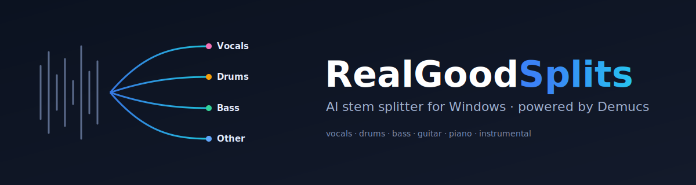
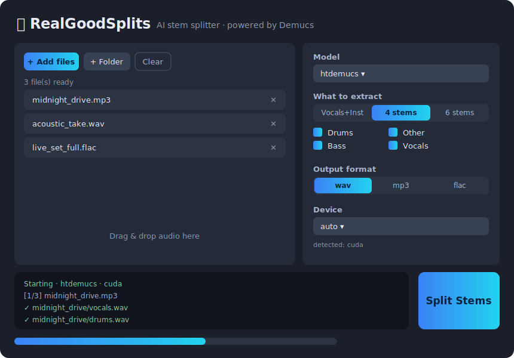

<p align="center">
  
</p>

<p align="center">
  <a href="#"></a>
  <a href="#"></a>
  <a href="https://github.com/facebookresearch/demucs"></a>
  <a href="LICENSE"></a>
</p>

**RealGoodSplits** is a clean, fast desktop app that splits any song into separate
**stems** — vocals, drums, bass, and more — using the state-of-the-art
[Demucs](https://github.com/facebookresearch/demucs) hybrid-transformer models.
Drop in a track, click one button, and get studio-quality acapellas, instrumentals,
and individual instrument tracks.

<p align="center">
  
</p>

---

## ✨ Features

- 🎚️ **High-quality separation** — powered by Demucs v4 (`htdemucs`, `htdemucs_ft`, 6-stem, and MDX models).
- 🪟 **Built for Windows** — one-click installer, a friendly GUI, and a CI-built standalone `.exe`. Runs great on macOS & Linux too.
- 🎤 **Karaoke mode** — one toggle for a clean **Vocals + Instrumental** pair.
- 🥁 **Pick your stems** — export any subset: vocals, drums, bass, other (plus guitar & piano with the 6-stem model).
- 📦 **Batch processing** — queue many files (or a whole folder) and walk away.
- 🖱️ **Drag & drop** — drop audio straight onto the window *(optional extra)*.
- ⚡ **GPU acceleration** — automatically uses your NVIDIA GPU (CUDA) or Apple Silicon (MPS) when available, CPU otherwise.
- 🎵 **WAV / MP3 / FLAC** output with selectable bitrate and bit depth.
- 🧰 **Full CLI** for scripting and automation.

---

## 🚀 Quick start (Windows)

The easy way — no command line required:

1. **Install [Python](https://www.python.org/downloads/windows/) 3.10–3.12.** On the
   first installer screen, tick **“Add python.exe to PATH.”**
2. [**Download this repo**](https://github.com/Therealdk8890/RealGoodSplits/archive/refs/heads/main.zip)
   and unzip it (or `git clone` it).
3. Double-click **`install_windows.bat`** and wait for it to finish (it downloads
   PyTorch the first time — grab a coffee ☕).
4. Double-click **`run.bat`** to launch the app.

> **Tip:** For NVIDIA GPU speed-ups, install the CUDA build of PyTorch *before* step 3:
> ```bat
> py -m venv .venv && .venv\Scripts\activate
> pip install torch torchaudio --index-url https://download.pytorch.org/whl/cu121
> ```
> then run `install_windows.bat`.

Prefer a prebuilt app? Go to the **[Actions tab](../../actions/workflows/build-windows.yml)**,
run **“Build Windows app,”** and download the zipped `.exe` artifact — or grab it from
[**Releases**](../../releases) when one is published.

---

## 🍎🐧 Install with pip (any OS)

```bash
git clone https://github.com/Therealdk8890/RealGoodSplits.git
cd RealGoodSplits
python -m venv .venv
source .venv/bin/activate          # Windows: .venv\Scripts\activate
pip install -r requirements.txt
pip install -e .

# launch the GUI
realgoodsplits          # or:  python -m realgoodsplits
```

Optional drag-and-drop support:

```bash
pip install tkinterdnd2
```

---

## 🖥️ Using the GUI

1. **Add files** (or a folder), or drag them onto the window.
2. Choose a **model** and what to extract:
   - **Vocals + Instrumental** — the karaoke pair.
   - **4 stems** — drums / bass / other / vocals.
   - **6 stems** — adds guitar & piano (`htdemucs_6s`).
3. Pick the **output format** and where to save.
4. Hit **Split Stems** and watch the progress bar. Done!

---

## ⌨️ Command line

```bash
# Basic 4-stem split
realgoodsplits-cli song.mp3

# Karaoke pair (vocals + instrumental) as 320 kbps MP3
realgoodsplits-cli song.mp3 --two-stems -f mp3 --mp3-bitrate 320

# Just the vocals and drums, highest-quality model, into ./out
realgoodsplits-cli song.wav -m htdemucs_ft --stems vocals drums -o ./out

# Batch a whole folder on the GPU
realgoodsplits-cli ./my_album -o ./stems --device cuda

# See every model
realgoodsplits-cli --list-models
```

Run `realgoodsplits-cli --help` for the full list of options (overlap, shifts,
segment size, bit depth, parallel jobs, …).

---

## 🧠 Models

| Model          | Stems | Notes                                              |
|----------------|:-----:|----------------------------------------------------|
| `htdemucs`     |   4   | **Default.** Best balance of speed and quality.    |
| `htdemucs_ft`  |   4   | Fine-tuned. Highest quality, ~4× slower.           |
| `htdemucs_6s`  |   6   | Adds **guitar** & **piano** (experimental).        |
| `mdx_extra`    |   4   | Strong non-transformer alternative.                |
| `mdx_extra_q`  |   4   | Quantised — smaller download, slightly lower quality. |

Model weights download automatically on first use and are cached for next time.

---

## 📦 Build a standalone Windows `.exe`

On a Windows machine with the project installed:

```bat
build_windows.bat
```

This produces `dist\RealGoodSplits\RealGoodSplits.exe` (a self-contained folder —
PyTorch makes it large). The same build runs automatically in
[**GitHub Actions**](.github/workflows/build-windows.yml).

---

## 🛠️ Troubleshooting

- **Reading MP3 / M4A fails** — install [FFmpeg](https://ffmpeg.org/download.html) and
  make sure it’s on your PATH (`winget install Gyan.FFmpeg` on Windows). WAV/FLAC work
  without it.
- **“CUDA not available”** — you installed the CPU build of PyTorch. Reinstall the CUDA
  build (see the GPU tip above), or just use `--device cpu` (slower but always works).
- **Out of memory on long tracks** — lower the segment size, e.g. `--segment 7`.
- **No drag-and-drop** — `pip install tkinterdnd2` (it’s optional).

---

## 🧪 Development

```bash
pip install pytest
pytest tests/test_unit.py          # fast, no ML deps
pytest tests/test_e2e.py           # real separation (needs torch + demucs)
```

The repo ships GitHub Actions that run the unit tests on Windows + Linux and a real
end-to-end separation on Windows for every push.

---

## 🙏 Credits & license

- Separation engine: **[Demucs](https://github.com/facebookresearch/demucs)** by Meta AI Research (MIT).
- GUI toolkit: **[CustomTkinter](https://github.com/TomSchimansky/CustomTkinter)**.

RealGoodSplits is released under the **[MIT License](LICENSE)**. Please respect the
copyright of any audio you process — separate only music you have the rights to use.
